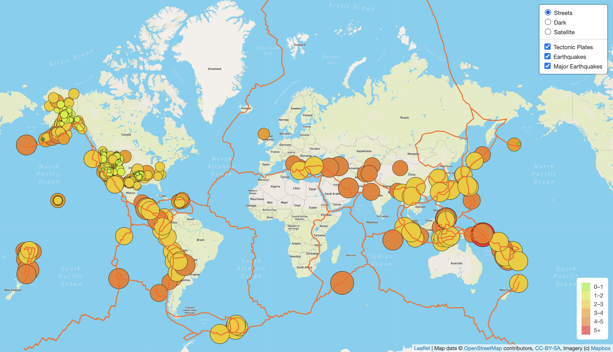

# Mapping_Earthquakes

## Overview
The purpose of this interactive visualization is to display earthquake occurance and magnitude along tectonic plate lines. The visualizations has bubbles and colors to show the size and magnitude of each earthquake. There are three different map styles that are light street view, a dark view, and a sateallite street view. There are three layers that can be toggled to show earthquakes, major earthquakes, and tectonic plates. This visualization can be used to show the correlation between earthquakes and their proximity to a tectonic plate line.